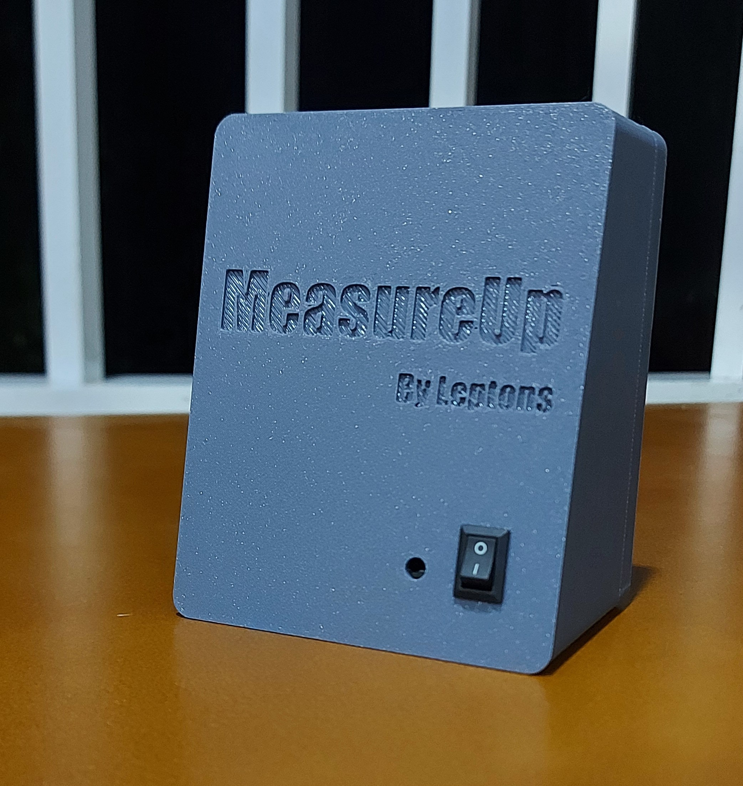
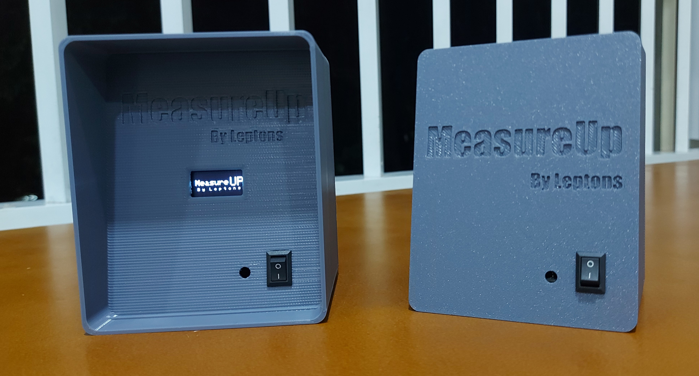
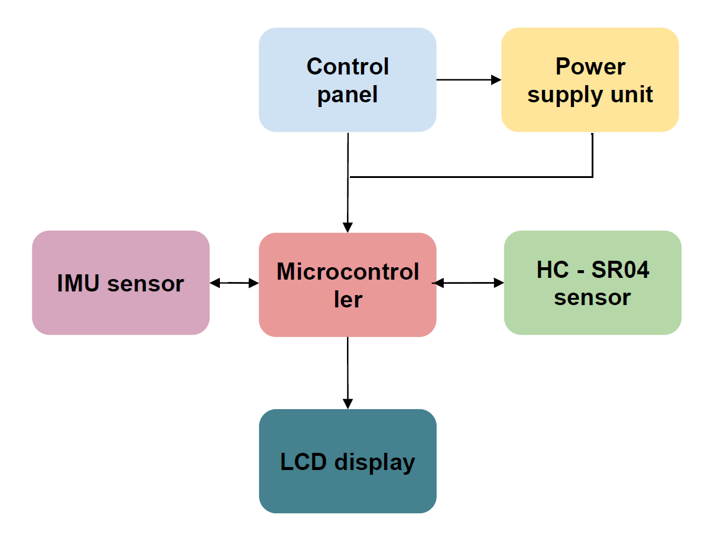
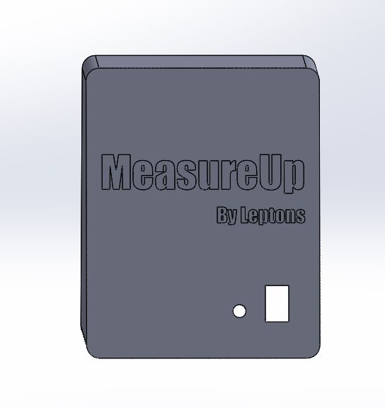
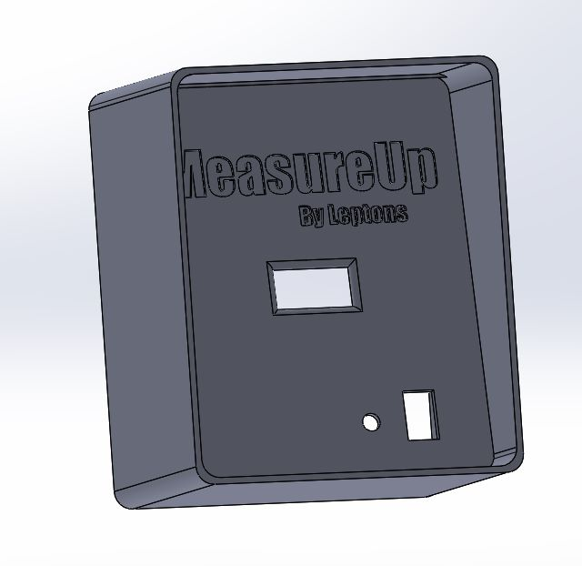

# Measure-Up

1. [Introduction](#introduction)
2. [Device Architecture](#device-architecture)
3. [Design](#design)

## 1. Introduction 

Measuring human height accurately is important in many fields, including healthcare, sports, and research. Moreover, height measurement is an important metric for paediatricians and their patients because height changes so rapidly during childhood and can indicate health concerns if it deviates from growth curves. The goal of this project was to create a digital version of the traditional physical height-measurement devices (also known as stadiometers) currently in use in hospitals and clinics. This device would be more portable while still maintaining the accuracy and speed of current devices.

### 1.1 Problem Description

Traditional methods of measuring height, such as using a measuring tape or stadiometer, require the assistance of a second person, which can be time-consuming and inconvenient. These methods have limitations that can lead to inaccurate measurements and inconvenience for both the person being measured and the person performing the measurement. Additionally, some individuals may experience discomfort or self-consciousness when being measured by another individual, which can lead to inaccurate measurements.

Furthermore, clinics require a dependable and precise method for measuring patient height. This is essential for a number of reasons, including monitoring the growth of children, tracking changes in adult height, and calculating the body mass index (BMI). Traditional height measurement methods, such as stadiometers, are typically immobile and require additional personnel to assist with the measurement process. Not only does this increase the labour costs associated with height measurement, but it also makes the process more cumbersome for both the clinic staff and the patients.

There is a need for a portable and independent height-measuring device that can provide accurate and reliable height measurements in clinical settings in order to address these issues. This device would reduce the labour costs associated with height measurement, eliminate the need for additional personnel to assist with the measurement process, and allow patients to independently measure their height, thereby reducing the burden on clinic staff.

### 1.2 The device

Our electronic height-measuring device is a portable and user-friendly device that allows patients to measure their height accurately and independently. The device is simple to use and requires minimal training or assistance. The device precisely measures the distance between the patient's head and the floor, which is then converted into an accurate height measurement. Our electronic height measurement device eliminates the need for additional personnel, enabling healthcare providers to allocate their resources more effectively.

The device comprises two key components. The first, designed for wall-mounting, initiates the measurement process when the patient positions themselves below it. Upon activation, it utilizes advanced sensors to determine floor distance, emitting three audible signals upon completion. The patient maintains a steady position during this brief operation. Following measurement, a final signal prompts the patient to proceed.

Simultaneously, using ATMEGA328P-PU microcontroller chips, the first component processes data, triggers alerts, and transmits information wirelessly. The second component, also equipped with the same microcontroller, receives and promptly displays the measured height for easy reference. Furthermore, the Arduino code utilized in both the transmitter and the receiver is accessible within the project repository for reference and future development.

## 2. Device Architecture 

### 2.1 Control Panel: 
The device's control panel includes two buttons: one for powering on the device and the other for unit selection that allows users to switch between measuring units.

### 2.2 Power Supply Unit:
The device is powered by a 12V power supply that is required to operate the ultrasonic sensor, gyroscope sensor, LED display, and microcontroller. The power supply is obtained by using two rechargeable 6V batteries.

### 2.3 Display: 
The device's display is a 16x2 LCD display that displays the measured height in the selected unit.

### 2.4 HC - SR04 Sensor:
The device uses an HC - SR04 sensor to measure the height between the device and the floor.

### 2.5 Inertial Measurement Unit: 
The device also features a gyroscope sensor that is used to measure the orientation of the device and calculate the perpendicular height using the data from the HC-SR04 sensor.

### 2.6 Microcontroller Unit: 
The microcontroller unit controls all device functions, including height measurement and unit selection.

## 3. Design 

### 3.1 Enclosure Design

